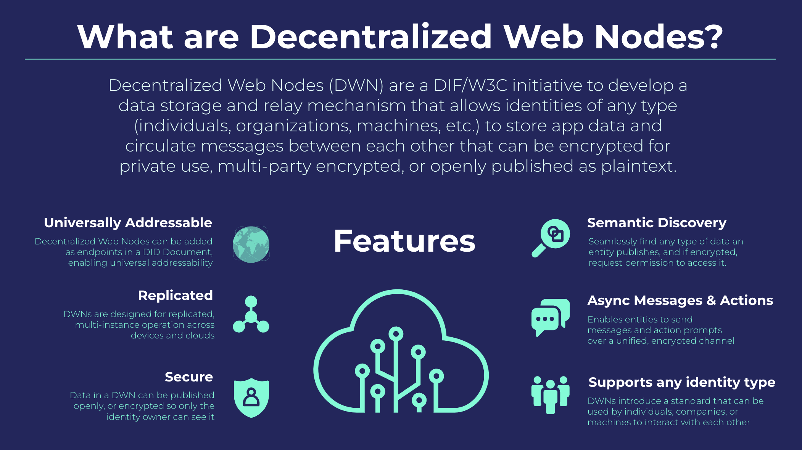
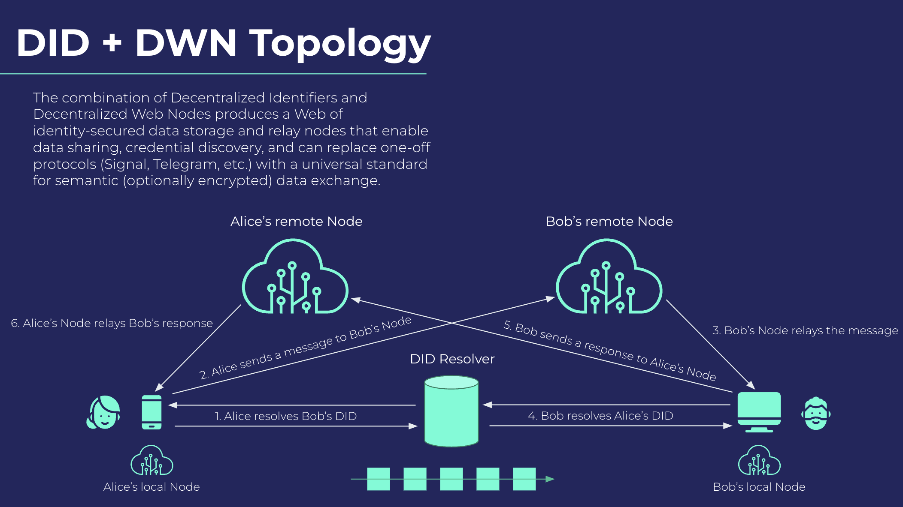

# Zion Relay v2

The new Zion relay server for decentralized social media and messaging.

## Features
- Decentralized message & media storage via [Decentralized Web Nodes](https://identity.foundation/decentralized-web-node/spec/)
- Account system for Bitcoin micropayments via Lightning
  - Connects to a funding source - initially [LND](https://github.com/lightningnetwork/lnd)
  - Adapted from [lnbits-infinity](https://github.com/lnbits/lnbits-infinity)

## Tech Stack
- [Go](https://go.dev/) - v1.17
- [LND](https://github.com/lightningnetwork/lnd) - Lightning integration
- _[ION](https://identity.foundation/ion/) - DIDs anchored to Bitcoin (later - MVP uses `did:key`)_
- _[IPFS](https://docs.ipfs.io/concepts/what-is-ipfs/) - Decentralized media storage (later - MVP uses local DB)_

## Specifications
We will gradually implement the following specifications:
- [Decentralized Web Nodes](https://identity.foundation/decentralized-web-node/spec/) (DIF)
  - Renamed from Identity Hubs
- [Decentralized Identifiers](https://www.w3.org/TR/did-core/) (W3C)
- [Verifiable Credentials](https://www.w3.org/TR/vc-data-model/) (W3C)

## Media hosting

Relays can set their own rules for:

- What sorts of media are accepted
- How much media uploads cost (in sats)
- Who may upload media
  - Zion-hosted relays may restrict media uploads to paying customers

## Who runs relays?

Zion runs a series of relays. The Zion v2 app connects to them by default.

Anyone can run their own relay. Users can connect their app to these other relays.

## Identity Hub architecture

Courtesy of [DIF](https://identity.foundation/)

## Previous codebases

Consolidating to this repo from previous v2 codebases [relay-dev](https://github.com/getZION/relay-dev) and our [lnbits fork](https://github.com/getZION/lnbits-infinity).
